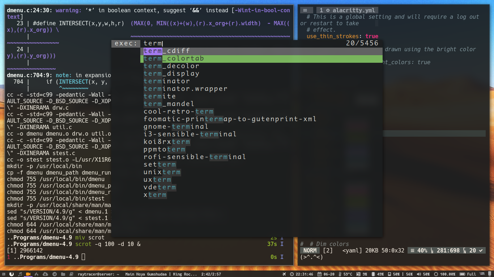

dmenu - dynamic menu
====================
dmenu is an efficient dynamic menu for X.

This is my custom build

Requirements
------------
In order to build dmenu you need the Xlib header files.

Installation
------------
Edit config.mk to match your local setup (dmenu is installed into
the /usr/local namespace by default).

Afterwards enter the following command to build and install dmenu
(if necessary as root):

    make clean install

Running dmenu
-------------
See the man page for details.

Uninstall dmenu
---------------
If you want to uninstall, run following into the root folder of dmenu build

	sudo make uninstall

Features
--------
* Add custom font(using Monaco in build)
* Change different types of colors of different parts of dmenu
* Show numbers
* Change lineheight
